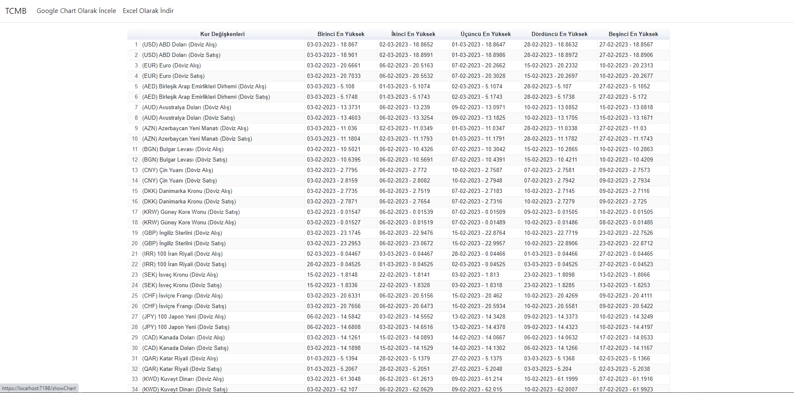
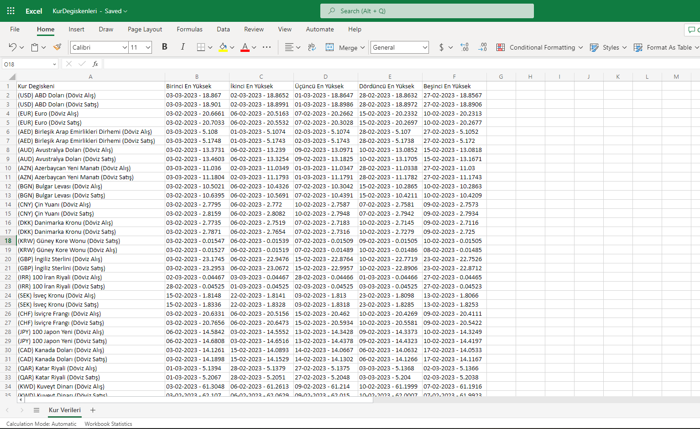

# Türkçe

### TCMB Test Case

Bu test case üzerinde istenenler şunlardır:

- TCMB üzerinde 03.02.2023 den 05.03.2023 e kadar olan kur verilerini API üzerinden çekip en yüksek 5 güne ait verileri aynı Solution üzerinde bir Core Web App üzerinde custome edip bu 5 günü Google Chart'ta gösteren ve ek olarak da 5 günün tarih ve kur bilgisini Excel'de listeleyen uygulama.

Yaptığım adımlar :

- TCMB üzerindeki web servisini (TCMB EVDS) inceledim ve dökümantasyonu içerisindeki parametrelere göre dönen kur verilerini JSON formatında nasıl alınacağını öğrendim.
- ASP.NET Core Web API oluşturup web servisi üzerinde gelen JSON dosyalarını HTTPClient aracılığıyla alıp Newtonsoft.JSON Nuget paketiyle deserialize ettim. Fakat gelen veriler bize kurların değişkenlerinin kodlarını () (mesela USD alım için TP_DK_USD_A_YTL) yine dökümantasyonu üzerinde yer alan Seri Listesi Servisi kısmından kurların kodlarına göre adlarını da JSON olarak HTTPClient aracılığıyla almamız gerekir.
Örnek olarak [AllExchangesJSON dosyası](AllExchangesJSON.md) üzerinden görüntüleyebilirsiniz.

- Modellerimizi oluşturup öncelikle verilen tarihler arasındaki kur değerlerini aldık sonra da bu kur değerlerinde değerlerin daha anlam kazanması için Seri Listesi Servisi üzerinden de seri koduna göre gelen Seri adını da getirmiş olduk. NULL gelen günler , iş çalışma saati dışında olduğu için bu günler alınmamıştır. Örnek olarak TP.DK.USD.A.YTL adlı seri kodu olan kur değişkeninin açıklamalı olarak web servisi üzerinden fetch alındığında JSON olarak gelen değerleri [CurrencyDetailJSON dosyası](CurrencyDetailJSON.md) üzerinden görüntüleyebilirsiniz.

- API yi tamamladıktan sonra ASP.NET Core MVC Web Application oluşturup Google Chart üzerinden inceleyebilmek ve Excel üzerinden export işlemi ile indirmek için bazı paketler ve servisler entegre edilmesi gerekir :
- Excel için <b>ClosedXML.Excel</b>
- Google Chart için CDN olarak https://www.gstatic.com/charts/loader.js sitesinden Javascript dosyalarını import etmek
- Yine kendi API miz üzerinden gelen verileri HTTPClient ile alıp deserialize etmek için <b>NewtonSoft.JSON</b>

- Gelen verilerimi Google Chart üzerinde görüntüleyebilmek için Controller üzerinde verilerimi almak yerine Client-Side üzerinden axios aracılığıyla aldım ve google chart üzerindeki chart lardan biri olan Table olarak import etmiş oldum.

- Gelen verilerimi Excel üzerinde inceleyip indirebilmek için Client-Side üzerinden değil de artık Controller üzerinden fetch aldım.

# Google Chart üzerinde Table ile incelenmesi

# Excel üzerinden export edilip indirmesi
